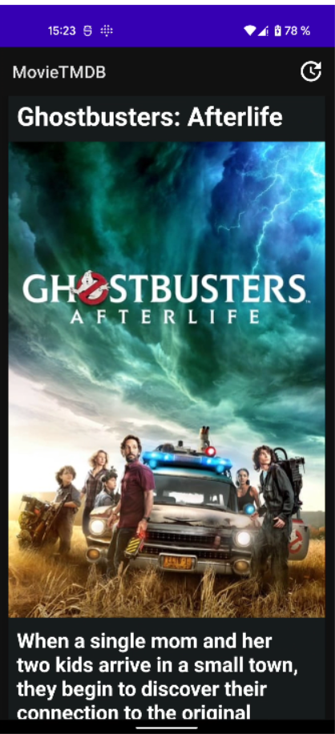

"# AndroidMovieDBMVVMCleanArchitecture"
A sample android app that shows how to use ViewModels and Room together with coroutine Dagger2, in Kotlin by Clean Architecture.

# Implemented by Clean Architecture
this project is structured to 3 layers:
1. Presentation
2.  Domain
3.  Data

# ScreenShots

# the Communication between layers
UI calls method from ViewModel.
ViewModel executes Use case.
Use case combines data from movies Repositories.
Each Repository returns data from a Data Source (Local, Cached or Remote).
Information is send back to the UI where we display the list of posts.

# Libraries Used
Dagger Library is used for Define DI-Dependencies Injections

Retrofit2 Used to call Data Fetch from network

Kotlin Coroutines Used to Define a thread or scope to call API's

RoomDB Used to store/Fetch data from Database
